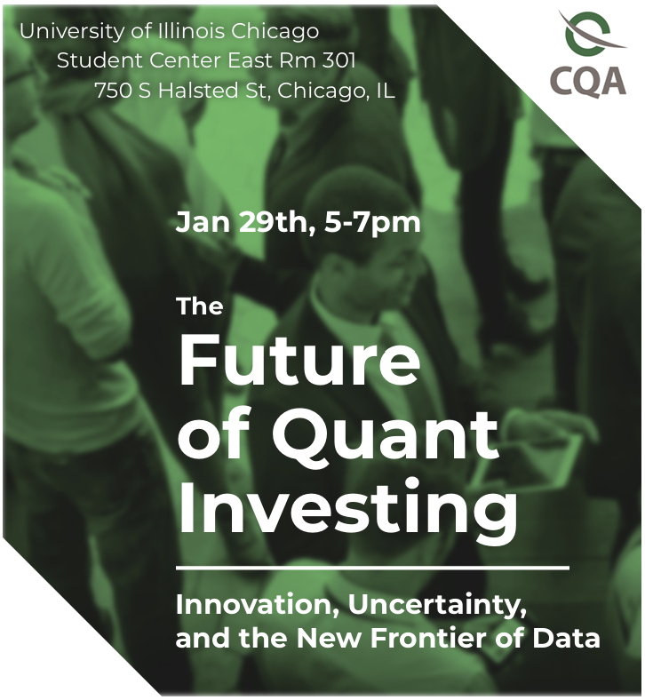

I was a panelist at a [CQA](https://cqa.org/) hosted event at UIC.



# Talking Points

Agenda:

-   Introduction and Background
-   Lessons Learned from My Career
-   Opportunities for Quants in the Future
    -   Apply quantiative skills across the broad universe of asset classes
    -   Use quantitative techniques to improve allocation among asset classes
    -   Improve manager selection within asset classes with quantitative rigor
-   Suggested Reading

# Resources

```{=html}

<iframe src="CQAYPNFlyer.pdf" title="Embedded PDF Viewer" width="100%" height="500px">
    <p>Your browser does not support iframes. <a href="CQAYPNFlyer.pdf">Download the PDF</a>.</p>
</iframe>
```