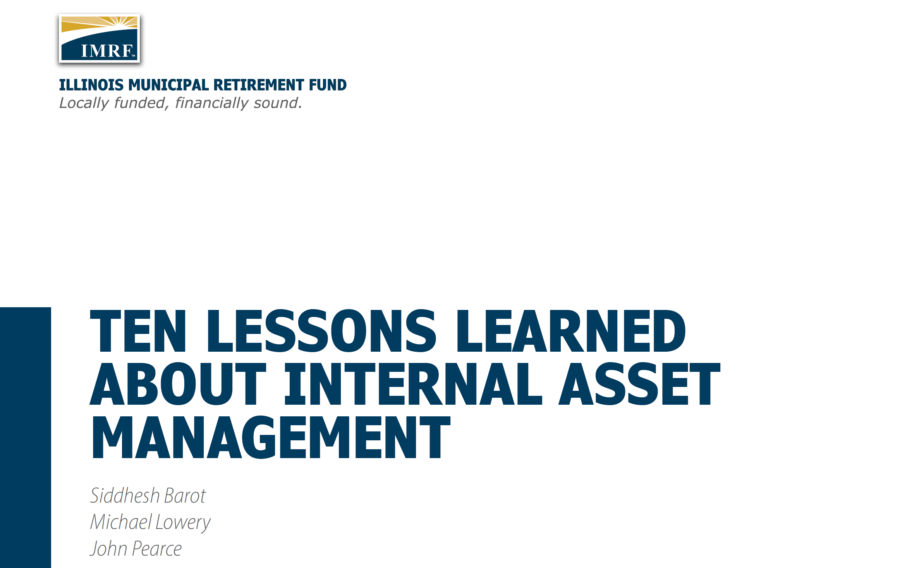

# Executive Summary

Asset owners are increasingly investigating and implementing internal asset management programs. The Illinois Municipal Retirement Fund (IMRF) launched its program in 2019. My coauthors and I share as insights “Ten Lessons Learned About Internal Asset Management”:

1.  **Understand Your “Why”**

    Flexibility, transparency, and alignment with the unique goals of your organization are at least as attractive as potential cost savings at scale.

2.  **Substitute or Complement?**

    Both. Maintaining an internal management program can help you get the best out of your external managers.

3.  **Rationalize Your Alpha Expectations...**

    Active management is challenging. Your expectations should be proportionate to your resources.

4.  **...and Your Beta Expectations, too**

    Passive management is challenging. No, really, it is.

5.  **Hire the Right Skillset**

    Asset owners may need to hire externally to find employees with relevant asset management experience.

6.  **Culture Fit is Important**

    Buy-side transplants will bring a new dynamic to an asset owner organization. Prepare each side to make a good first impression.

7.  **Understand Incentives**

    Shifting towards internal management exchanges one set of incentives for another through risk and reward motivations.

8.  **The Devil is in the (Operational) Details**

    Operational missteps can scuttle a new program. Manage operational risk with comprehensive documentation and careful attention to detail.

9.  **Vendor Management is Key**

    Thoughtfully select vendor partnerships who can champion your initiative.

10. **Have a (Flexible) Long-Term Vision**

    When getting started, don’t let perfect be the enemy of good.

# Request the Full Report

The full report is available upon request by emailing [me](mailto:john@atypicalquant.com?subject=Requesting%20the%20Full%20Ten%20Lessons%20Report).

[](mailto:john@atypicalquant.com?subject=Requesting%20the%20Full%20Ten%20Lessons%20Report)

````{=html}
<!--
```{=html}

<iframe src="ten_lessons.pdf" title="Embedded PDF Viewer" width="100%" height="500px">
    <p>Your browser does not support iframes. <a href="ten_lessons.pdf">Download the PDF</a>.</p>
</iframe>
```
-->
````

<!-- a -->
