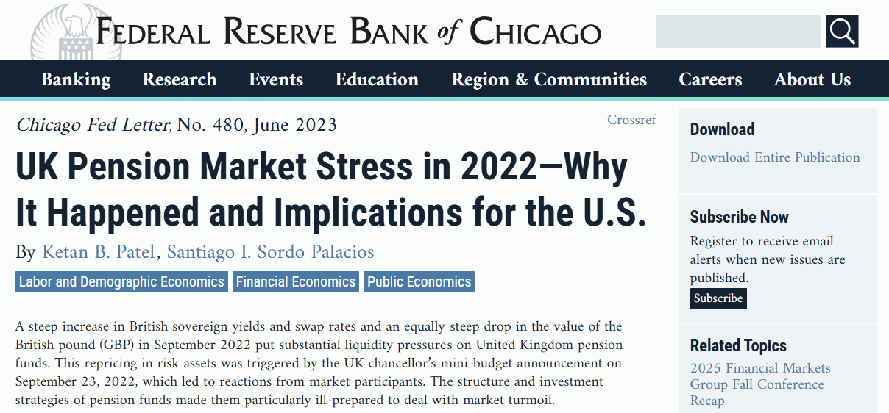

In the aftermath of the so called "Gilt Crisis" in September and October 2022, researchers at the Chicago Fed were assessing to what extent a similar event in the US Treasury market would stress US pension funds. I happened to meet the researchers who authored this report through Chicago Booth and they requested comments from my team. We gave a brief interview over virtual meeting and reviewed the draft report before publication earning an acknowledgement at the end of the report.

During our conversations with the authors we pointed out that US pension funds tend not to engage in the types of levered bond trades favored by the LDI strategies of the UK schemes. Accordingly, volatility in the bond market during an event like the British yield drop in the Fall of 2022 would not likely cause acute stress for US pension funds. However, US pension funds do have large allocations to other risky assets including Private Equity and Private Credit. The authors incorporated this feedback saying "\[w\]hile this implies that U.S. pension funds may be less vulnerable to a similar shock, underfunded pension funds may tend to invest in relatively risky assets in their reach for yield. Moreover, there may be other pockets of vulnerabilities in the broader U.S. economy, particularly related to leverage and/or liquidity…"

# Read the Full Report

The full report is here: [Chicago Fed Letter - UK Pension Market Stress in 2022](https://www.chicagofed.org/publications/chicago-fed-letter/2023/480).

[](https://www.chicagofed.org/publications/chicago-fed-letter/2023/480)

````{=html}
<!--
```{=html}

<iframe src="uk_pension_stress.pdf" title="Embedded PDF Viewer" width="100%" height="500px">
    <p>Your browser does not support iframes. <a href="ten_lessons.pdf">Download the PDF</a>.</p>
</iframe>
```
-->
````
