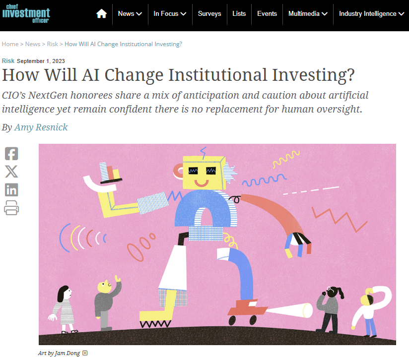

I was quoted by Chief Investment Officer magazine an article on the impact of AI in Institutional Investing.

# Read the Full Article

The article including my quotes can be found here: [How will AI Change Institutional Investing? - CIO](https://www.ai-cio.com/news/how-will-ai-change-institutional-investing/).

[](https://www.ai-cio.com/news/how-will-ai-change-institutional-investing/)

````{=html}
<!--
```{=html}

<iframe src="uk_pension_stress.pdf" title="Embedded PDF Viewer" width="100%" height="500px">
    <p>Your browser does not support iframes. <a href="ten_lessons.pdf">Download the PDF</a>.</p>
</iframe>
```
-->
````
