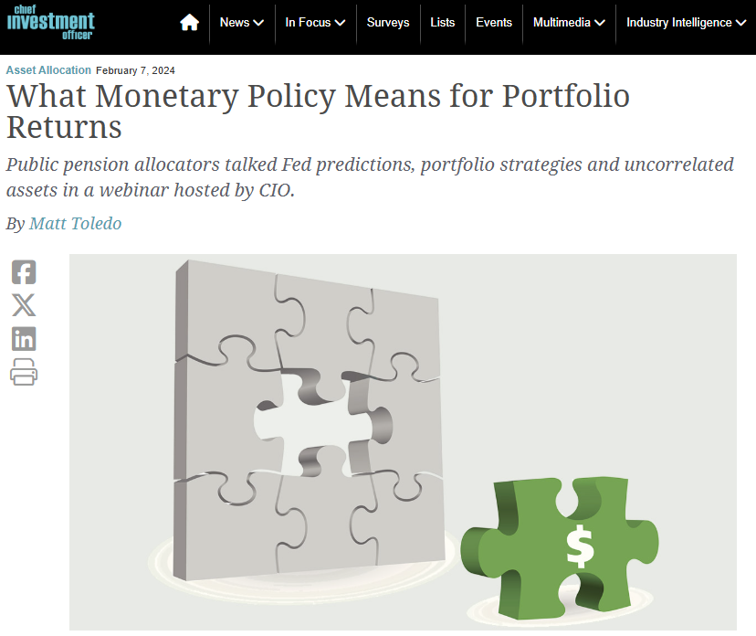

I participated as a panelist in a Chief Investment Officer magazine discussion on the impact of monetary policy for markets in 2024. Quotes of mine were later published into an article summarizing the panel discussion.

# Read the Full Article

The article including my quotes can be found here: [What Monetary Policy Means for Portfolio Returns - CIO](https://www.ai-cio.com/news/what-monetary-policy-means-for-portfolio-returns/).

[](https://www.ai-cio.com/news/what-monetary-policy-means-for-portfolio-returns/)

````{=html}
<!--
```{=html}

<iframe src="uk_pension_stress.pdf" title="Embedded PDF Viewer" width="100%" height="500px">
    <p>Your browser does not support iframes. <a href="ten_lessons.pdf">Download the PDF</a>.</p>
</iframe>
```
-->
````
