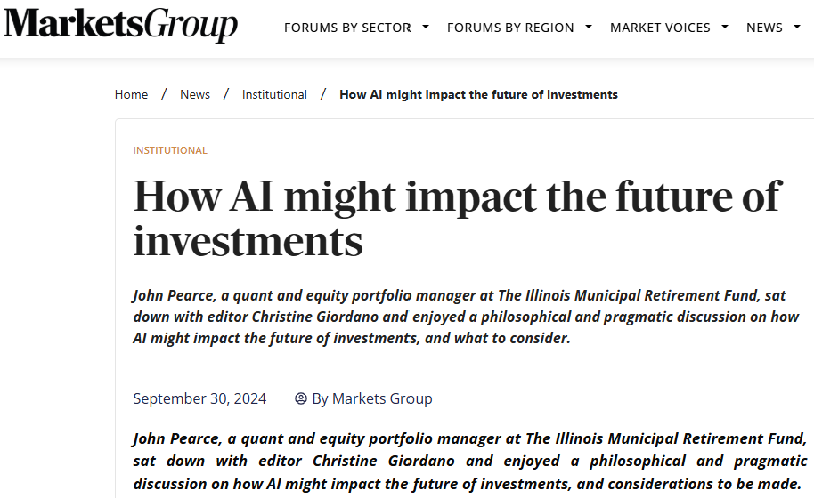

I was interviewed by Markets Group for a feature on the impact of AI on the Future of Investments.

# Read the Full Interview

The full interview can be found here: [How AI Might Impact the Future of Investments - Markets Group](https://www.marketsgroup.org/news/How-AI-might-impact-future-investments).

[](https://www.marketsgroup.org/news/How-AI-might-impact-future-investments)

````{=html}
<!--
```{=html}

<iframe src="uk_pension_stress.pdf" title="Embedded PDF Viewer" width="100%" height="500px">
    <p>Your browser does not support iframes. <a href="ten_lessons.pdf">Download the PDF</a>.</p>
</iframe>
```
-->
````
